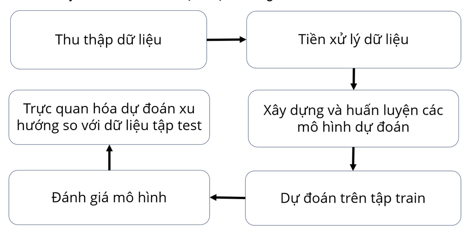
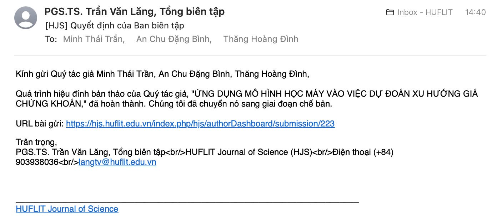

# Stock-Prediction-for-VN30-Index-Stocks-in-Vietnam
## Introduction_Giới thiệu
This project develops statistical models on VNINDEX stock time series data to forecast price trends. By applying data preprocessing, parameter optimization, and model training, it utilizes methods such as ARIMA, VAR, Holt-Winters, and Facebook Prophet, showcasing their effectiveness in time series prediction.

## Dưới đây là mô tả các bước trong dự án **dự đoán Xu hướng chứng khoán**, bắt đầu từ bước: 


### 1. **Data Mining (Khai thác dữ liệu)**

#### 1.1. **Identifying Data Sources_Xác định nguồn dữ liệu**
   - Tìm kiếm các nguồn dữ liệu chứng khoán đáng tin cậy  Vietstock, v.v.
   - Việc lựa chọn các cổ phiếu trong nhóm VN30 làm đối tượng phân tích:
      + "Blue chip" đại diện cho các công ty có giá trị vốn hóa lớn, uy tín cao, và hoạt động kinh doanh ổn định. Do đó, chúng phản ánh phần lớn tình hình kinh tế và thị trường chứng khoán Việt Nam.
      + Lượng dữ liệu thu thập được không quá lớn phù hợp với tài nguyên tôi có được, đảm bảo quá trình huấn luyện mô hình có đủ thông tin để học và phục vụ cho việc dự đoán sau này.

#### 1.2. **Data Collection_Thu thập dữ liệu**
   - **Thu thập dữ liệu lịch sử**: Để xây dựng mô hình dự đoán giá cổ phiếu, việc đầu tiên là thu thập dữ liệu lịch sử của các mã chứng khoán. Dữ liệu bao gồm các đặc trưng chính như thời gian, giá mở cửa, giá đóng cửa, giá cao, giá thấp, khối lượng giao dịch, và mã chứng khoán. Dưới đây là bảng minh họa cho các đặc trưng này:

| **STT** | **Đặc trưng** | **Kiểu dữ liệu** | **Ý nghĩa**                                             | **Ví dụ**     |
|---------|---------------|------------------|---------------------------------------------------------|---------------|
| 1       | `time`        | `datetime`       | Ngày diễn ra phiên giao dịch                             | 02/01/2019    |
| 2       | `open`        | `Numeric`        | Giá mở đầu cho phiên giao dịch hay còn gọi là giá mở cửa | 94900         |
| 3       | `high`        | `Numeric`        | Giá cao nhất đạt được trong phiên giao dịch cùng ngày   | 96200         |
| 4       | `low`         | `Numeric`        | Giá thấp nhất đạt được trong phiên giao dịch cùng ngày  | 94800         |
| 5       | `close`       | `Numeric`        | Giá kết thúc phiên giao dịch cùng ngày (giá đóng cửa)   | 96000         |
| 6       | `volume`      | `Numeric`        | Khối lượng giao dịch trong phiên giao dịch cùng ngày    | 2017000       |
| 7       | `ticker`      | `Nominal`        | Mã chứng khoán của các công ty trên sàn giao dịch        | FPT           |

### Ví dụ dữ liệu của mã FPT :
| time       | open  | high  | low   | close | volume  | ticker |
|------------|-------|-------|-------|-------|---------|--------|
| 2019-01-02 | 94900 | 96200 | 94800 | 96000 | 2017000 | FPT    |
| 2019-01-03 | 96000 | 97000 | 95000 | 96500 | 1500000 | FPT    |


#### 1.3. **Data Cleaning_Làm sạch dữ liệu**
   - **Handling Missing Data_Xử lý dữ liệu thiếu**: Kiểm tra và xử lý các giá trị thiếu trong bộ dữ liệu (loại bỏ hoặc điền vào dữ liệu thiếu).
   - **Removing Outliers_Loại bỏ outliers**: Phát hiện và loại bỏ các giá trị bất thường (outliers) có thể làm sai lệch kết quả phân tích.
   - **Data Normalization_Chuẩn hóa dữ liệu**: Đảm bảo rằng tất cả các đặc trưng (features) trong dữ liệu có định dạng và đơn vị giống nhau để dễ dàng xử lý.

#### 1.4. **Data Preprocessing_Tiền xử lý dữ liệu**
   - **Chuyển đổi dữ liệu thành dạng thích hợp**: Chuyển dữ liệu thô thành các định dạng có thể sử dụng và bảo quản dễ dàng dưới dạng csv. Và một vài chỉnh sửa để phù hợp đầu vào của từng mô hình
   - **Data Splitting_Phân chia dữ liệu**: Chia dữ liệu thành các tập huấn luyện và tập kiểm tra (train/test) để sử dụng trong việc xây dựng và đánh giá mô hình.
##### Lưu ý: Đây là dữ liệu time series và thu thập 30 mã nối tiếp nhau trong bộ dữ liệu, việc chia dữ liệu train/test theo cách ngẫu nhiên làm mất giá trị liền mạch chuỗi hay tránh việc chỉ huấn luyện mấy chục mã đầu nhưng lại đem 1 vài mã ở phía cuối dữ liệu ra thử nghiệm.
Tham khảo theo cách lấy và chia dữ liệu thủ công của tôi 

```python
#ComVN30_train
vn30_data = {}
for ticker in vn30_tickers:
    try:
        data = vs.stock_historical_data(symbol=ticker, start_date="2019-01-01", end_date='2023-12-31', source='DNSE')
        vn30_data[ticker] = data
    except:
        print(f"Failed to load data for {ticker}")
```

```python
#ComVN30_test
vn30_test = {}
for ticker in vn30_tickers:
    try:
        data = vs.stock_historical_data(symbol=ticker, start_date="2024-01-01", end_date='2024-05-01')
        vn30_test[ticker] = data
    except:
        print(f"Failed to load data for {ticker}")
```
### 2. **Build models, training (Xây dựng mô hình, huấn luyện trên tập train)**  
- ARIMA: Autoregressive Integrated Moving Average, sử dụng cho dự báo chuỗi thời gian với xu hướng và mùa vụ.
- VAR: Vector Autoregression, mô hình dự báo tương quan giữa nhiều chuỗi thời gian.
- Holt-Winters: Mô hình dự báo với xu hướng và mùa vụ, đặc biệt thích hợp cho chuỗi thời gian có tính chu kỳ.
- Facebook Prophet: Mô hình dự báo mạnh mẽ cho dữ liệu chuỗi thời gian với xu hướng và mùa vụ không đều.

### 3. **Predict trends (Dự đoán xu hướng giá trên tập train)**  
- Sử dụng các mô hình ARIMA, VAR, Holt-Winters và Facebook Prophet để dự đoán xu hướng giá cổ phiếu.

### 4. **Evaluate models and visualize trends based on the test set (Đánh giá mô hình và trực quan hóa xu hướng giá dựa trên tập test)**  
- Đánh giá độ chính xác mô hình bằng các chỉ số MAE và RMSE, trực quan hóa kết quả dự báo với đồ thị.
### Research Results
Sau đây là bảng: So sánh kết quả thang đo đánh giá trung bình giữa các mô hình

| Model                                    | MAE       | RMSE      |
|------------------------------------------|-----------|-----------|
| ARIMA                                    | 42,557.95 | 42,486.06 |
| VAR                                      | 4,400.07  | 3,817.61  |
| Additive Holt-Winters                    | 3,533.63  | 4,077.04  |
| Multiplicative Holt-Winters              | 3,557.57  | 4,091.04  |
| Additive Seasonality Facebook Prophet    | 3,358.70  | 4,003.01  |
| Multiplicative Seasonality Facebook Prophet | 3,887.96  | 4,605.60  |

# Summary
## Conclusion

Building and applying time series prediction models on stock market data brings significant insights and benefits to the financial and economic sectors. By constructing models to predict stock price trends, newcomers to the field can make more informed investment choices, while economic experts can use these models to identify key factors influencing the market. With the assistance of prediction models, experts can detect and issue warnings about factors that impact the economy.

The use of ARIMA, VAR, Holt-Winters, and Facebook Prophet models, trained on stock data, highlights the importance of selecting models tailored to the characteristics of each stock dataset, thereby enhancing the accuracy of predictions. The results of this study indicate that Facebook Prophet is the most optimal model for making predictions.

However, the study still faces several limitations:
- Large and voluminous data, which can affect the model's output.
- Numerous issues in data collection, model construction, and optimization.
- Resource-intensive models such as Holt-Winters.
- Lack of an application to deploy the prediction models.

## Future Directions

- Continue research and delve deeper into prediction models.
- Improve and adjust model parameters to enhance prediction performance.
- Develop websites or applications to deploy prediction models with continuously updated data from stock exchanges.
- Expand research into other prediction fields, such as weather forecasting and healthcare.
- Investigate additional prediction models and combine them with the current models.

